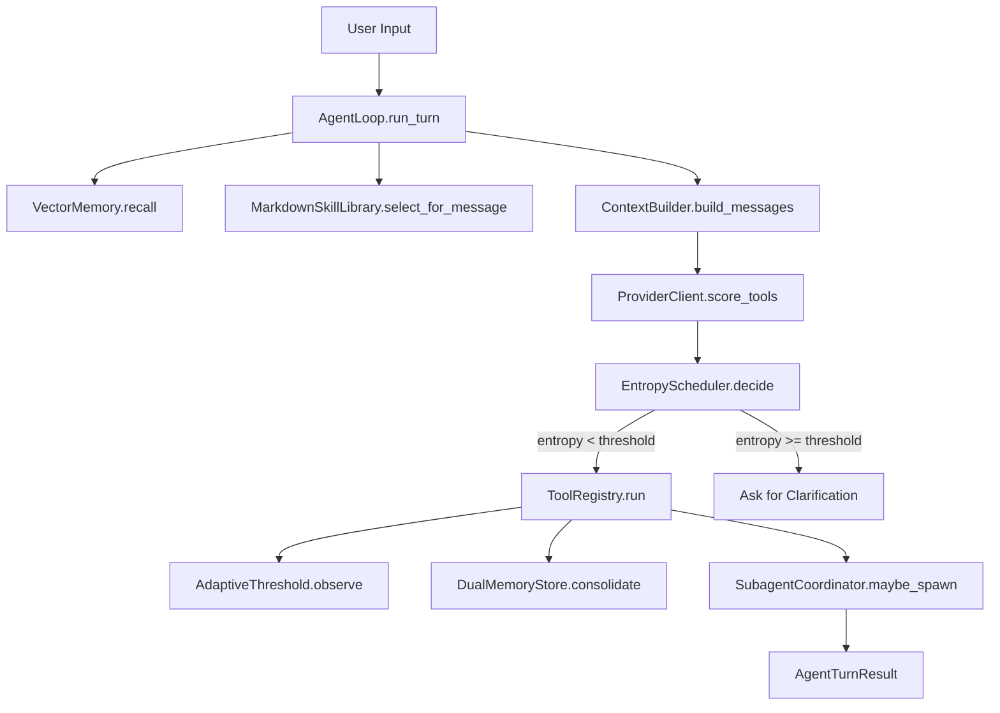
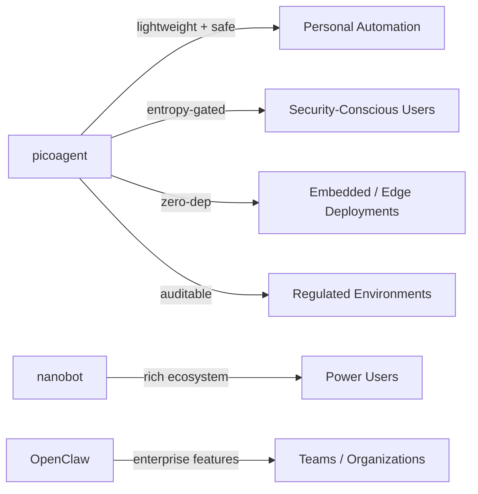
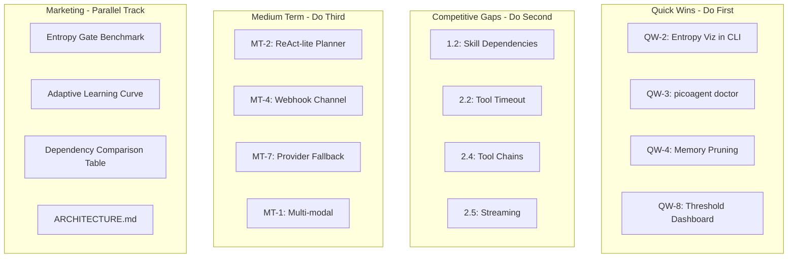

# picoagent Competitive Improvement Roadmap

> **Philosophy**: Every improvement must earn its place. If it can't be implemented in ≤ 200 lines of pure stdlib + existing deps, it needs a very strong justification. picoagent's core differentiator is *auditable simplicity* — the entire runtime fits in a single reading session.

---

## System Architecture Overview



---

## 1. Gaps vs nanobot

nanobot is the closest architectural sibling — picoagent already clones its SKILL.md format. These are the gaps that can be closed **lightly**:

### 1.1 Skill Hot-Reload
- **What nanobot has**: Skills are reloaded on every invocation without restarting the daemon.
- **What picoagent does**: [`MarkdownSkillLibrary.list_skills()`](picoagent/skills/markdown.py:22) re-reads disk on every call — this is actually already hot-reload! But there is no `inotify`/`FSEvents` watcher to invalidate a cache if one is added later.
- **Gap**: No explicit cache invalidation hook or `--reload-skills` CLI command.
- **Fix**: Add a `picoagent reload-skills` CLI subcommand that sends `SIGHUP` to the running gateway process, plus a `mtime`-based cache in `MarkdownSkillLibrary`.
- **Files**: [`picoagent/skills/markdown.py`](picoagent/skills/markdown.py), [`picoagent/cli.py`](picoagent/cli.py)
- **LOC impact**: ~40 lines

### 1.2 Skill Dependency Declarations
- **What nanobot has**: Skills can declare `requires:` other skills or tools in their SKILL.md front-matter.
- **What picoagent does**: Skills are selected independently; no dependency graph.
- **Gap**: A skill like `github` might need `shell` to be active simultaneously.
- **Fix**: Parse a YAML front-matter block at the top of SKILL.md (using stdlib `re` only — no `pyyaml`) to extract `requires:` and `tags:` fields. Auto-activate required skills when a primary skill is selected.
- **Files**: [`picoagent/skills/markdown.py`](picoagent/skills/markdown.py)
- **LOC impact**: ~60 lines

### 1.3 Skill Invocation Telemetry
- **What nanobot has**: Per-skill usage counters and last-used timestamps.
- **What picoagent does**: No skill-level metrics.
- **Gap**: No way to know which skills are actually being used vs. dead weight.
- **Fix**: Append a lightweight JSON line to `~/.picoagent/skill_stats.jsonl` on each skill activation. Add `picoagent skill-stats` CLI command to display a sorted table.
- **Files**: [`picoagent/skills/markdown.py`](picoagent/skills/markdown.py), [`picoagent/cli.py`](picoagent/cli.py)
- **LOC impact**: ~50 lines

### 1.4 Skill Score Transparency
- **What nanobot has**: Debug output showing why a skill was selected.
- **What picoagent does**: [`select_for_message()`](picoagent/skills/markdown.py:50) returns skills silently; no score is surfaced.
- **Gap**: Users can't understand or tune skill selection.
- **Fix**: Return `(skill, score, reason)` tuples from `select_for_message`. Surface in `--verbose` CLI mode and in `AgentTurnResult`.
- **Files**: [`picoagent/skills/markdown.py`](picoagent/skills/markdown.py), [`picoagent/agent/loop.py`](picoagent/agent/loop.py)
- **LOC impact**: ~30 lines

### 1.5 Skill Hub / Registry URL
- **What nanobot has**: A public skill registry that users can browse and install from.
- **What picoagent does**: The `clawhub` skill in [`skills/clawhub/SKILL.md`](skills/clawhub/SKILL.md) references a hub concept but there is no `picoagent install-skill <name>` command.
- **Gap**: Discovery and installation friction.
- **Fix**: Add `picoagent install-skill <github-user/repo>` that does a `git clone` (or `urllib` download of a zip) into `~/.picoagent/skills/`. No new deps needed.
- **Files**: [`picoagent/cli.py`](picoagent/cli.py)
- **LOC impact**: ~80 lines

---

## 2. Gaps vs OpenClaw

OpenClaw is a heavier framework. Only the gaps that can be closed without bloat are listed here:

### 2.1 Structured Tool Output / Typed Results
- **What OpenClaw has**: Tools return typed, structured objects (not just strings). Downstream tools can consume structured output.
- **What picoagent does**: [`ToolResult.output`](picoagent/agent/tools/registry.py:9) is always a plain `str`. The `metadata` dict exists but is not used for inter-tool communication.
- **Gap**: No tool chaining or structured data passing.
- **Fix**: Add an optional `data: dict | None` field to `ToolResult`. The `AgentLoop` can pass `result.data` as context to the next tool call. No new deps.
- **Files**: [`picoagent/agent/tools/registry.py`](picoagent/agent/tools/registry.py), [`picoagent/agent/loop.py`](picoagent/agent/loop.py)
- **LOC impact**: ~25 lines

### 2.2 Tool Timeout & Cancellation
- **What OpenClaw has**: Per-tool configurable timeouts with graceful cancellation.
- **What picoagent does**: [`ToolRegistry.run()`](picoagent/agent/tools/registry.py:51) has no timeout. A hanging shell command blocks the entire event loop.
- **Gap**: No protection against runaway tools.
- **Fix**: Wrap `await tool.run(...)` in `asyncio.wait_for(tool.run(...), timeout=config.tool_timeout_seconds)`. Add `tool_timeout_seconds: int = 30` to `AgentConfig`.
- **Files**: [`picoagent/agent/tools/registry.py`](picoagent/agent/tools/registry.py), [`picoagent/config.py`](picoagent/config.py)
- **LOC impact**: ~20 lines

### 2.3 Tool Result Caching
- **What OpenClaw has**: Idempotent tool calls (e.g., `read_file` on the same path) are cached within a session.
- **What picoagent does**: Every tool call hits disk/network unconditionally.
- **Gap**: Repeated reads of the same file waste LLM context and latency.
- **Fix**: Add an in-memory `dict[tuple[str, str], ToolResult]` cache keyed by `(tool_name, canonical_args_hash)` in `ToolRegistry`. TTL of 60s. Opt-out via `cacheable = False` on tool class.
- **Files**: [`picoagent/agent/tools/registry.py`](picoagent/agent/tools/registry.py)
- **LOC impact**: ~45 lines

### 2.4 Multi-turn Tool Chains (Plan-Execute)
- **What OpenClaw has**: The agent can plan a sequence of tool calls and execute them in order.
- **What picoagent does**: Single tool per turn. The `SubagentCoordinator` only does a review pass, not a follow-up action.
- **Gap**: Complex tasks requiring multiple steps need multiple user turns.
- **Fix**: Add a `max_tool_chain: int = 3` config option. After a successful tool call, re-run `score_tools` on the combined `user_message + tool_output`. If entropy is low and a different tool scores highest, chain it automatically. Stop when entropy is high or `max_tool_chain` is reached.
- **Files**: [`picoagent/agent/loop.py`](picoagent/agent/loop.py), [`picoagent/config.py`](picoagent/config.py)
- **LOC impact**: ~70 lines

### 2.5 Streaming Response Support
- **What OpenClaw has**: Streaming token output for long responses.
- **What picoagent does**: [`ProviderClient.chat()`](picoagent/providers/registry.py:39) returns a complete string. No streaming.
- **Gap**: Long responses feel slow; no progressive feedback.
- **Fix**: Add `stream: bool = False` parameter to `chat()`. When `True`, use `urllib` chunked transfer and yield tokens via an `AsyncGenerator`. Channel adapters (CLI, Telegram) can consume the stream. This is stdlib-only.
- **Files**: [`picoagent/providers/registry.py`](picoagent/providers/registry.py), [`picoagent/channels/cli.py`](picoagent/channels/cli.py)
- **LOC impact**: ~90 lines

### 2.6 Conversation Export / Import
- **What OpenClaw has**: Export conversation history to JSON/Markdown; import to resume.
- **What picoagent does**: Sessions are stored in `sessions.json` but there is no CLI to export/import them in a human-readable format.
- **Gap**: No portability or backup of conversations.
- **Fix**: Add `picoagent export-session <session_id> [--format md|json]` and `picoagent import-session <file>` CLI commands.
- **Files**: [`picoagent/cli.py`](picoagent/cli.py), [`picoagent/session.py`](picoagent/session.py)
- **LOC impact**: ~60 lines

### 2.7 Plugin / Extension API
- **What OpenClaw has**: A formal plugin API with lifecycle hooks (`on_start`, `on_turn`, `on_tool_result`).
- **What picoagent does**: No hook system. Customization requires forking.
- **Gap**: Third-party extensions are impossible without modifying core files.
- **Fix**: Add a minimal `HookRegistry` with `on_turn_start`, `on_tool_result`, `on_turn_end` hooks. Hooks are plain async callables registered via `picoagent.hooks.register(...)`. No new deps.
- **Files**: New file `picoagent/hooks.py`, [`picoagent/agent/loop.py`](picoagent/agent/loop.py)
- **LOC impact**: ~80 lines

---

## 3. Quick Wins (Low Effort, High Impact)

These can be implemented in a single PR each and immediately improve the competitive position:

### QW-1: `--dry-run` Mode
- **What**: Add `--dry-run` flag to `picoagent agent`. Shows what tool would be selected and with what args, without executing it.
- **Why**: Builds user trust in the entropy routing system. Unique differentiator for security-conscious users.
- **Files**: [`picoagent/agent/loop.py`](picoagent/agent/loop.py), [`picoagent/cli.py`](picoagent/cli.py)
- **LOC**: ~25 lines

### QW-2: Entropy Visualization in CLI
- **What**: In interactive CLI mode, show a mini entropy bar after each turn: `[entropy: ██░░░ 1.2 bits / threshold: 1.5]`.
- **Why**: Makes the Shannon Entropy gating *visible* and *understandable* — turns a hidden math feature into a marketing asset.
- **Files**: [`picoagent/cli.py`](picoagent/cli.py)
- **LOC**: ~20 lines

### QW-3: `picoagent doctor` Command
- **What**: A health-check command that validates config, tests provider connectivity, checks memory file integrity, and lists active channels.
- **Why**: Reduces onboarding friction. Competitors have similar commands (`nanobot check`, etc.).
- **Files**: [`picoagent/cli.py`](picoagent/cli.py)
- **LOC**: ~60 lines

### QW-4: Memory Pruning Command
- **What**: `picoagent prune-memory [--older-than 30d] [--min-score 0.1]` to remove stale or low-relevance memory records from the `.npz` store.
- **Why**: VectorMemory grows unbounded. Users have no way to manage it today.
- **Files**: [`picoagent/core/memory.py`](picoagent/core/memory.py), [`picoagent/cli.py`](picoagent/cli.py)
- **LOC**: ~50 lines

### QW-5: Tool Aliases
- **What**: Allow users to define tool aliases in config: `"tool_aliases": {"sh": "shell", "f": "file"}`. The routing layer resolves aliases before entropy scoring.
- **Why**: Power users want shorthand. Reduces friction for frequent commands.
- **Files**: [`picoagent/config.py`](picoagent/config.py), [`picoagent/agent/loop.py`](picoagent/agent/loop.py)
- **LOC**: ~30 lines

### QW-6: Structured Onboarding Wizard
- **What**: Improve `picoagent onboard` to interactively ask for provider, API key, and preferred channels. Currently it just creates a blank config.
- **Why**: First-run experience is critical for adoption. Competitors have polished onboarding.
- **Files**: [`picoagent/cli.py`](picoagent/cli.py)
- **LOC**: ~80 lines

### QW-7: `CHANGELOG.md` Auto-Update Hook
- **What**: When `dual_memory` consolidates a session, also append a one-line summary to `~/.picoagent/CHANGELOG.md` with date and session key.
- **Why**: Gives users a human-readable audit trail of what the agent did over time. Zero new deps.
- **Files**: [`picoagent/core/dual_memory.py`](picoagent/core/dual_memory.py)
- **LOC**: ~15 lines

### QW-8: Adaptive Threshold Dashboard
- **What**: `picoagent threshold-stats` command showing current threshold, success rate, failure rate, and a sparkline of recent adjustments.
- **Why**: Makes the adaptive learning system visible and trustworthy. Unique to picoagent.
- **Files**: [`picoagent/cli.py`](picoagent/cli.py), [`picoagent/core/adaptive.py`](picoagent/core/adaptive.py)
- **LOC**: ~40 lines

---

## 4. Medium-Term Improvements

These require more design work but deliver significant competitive gains:

### MT-1: Multi-modal Input (Images)
- **What**: Accept image paths or base64 data in user messages. Pass to providers that support vision (OpenAI, Anthropic, Gemini). Extract text description for memory storage.
- **Why**: Both nanobot and OpenClaw support images. This is increasingly expected.
- **Files**: [`picoagent/providers/registry.py`](picoagent/providers/registry.py), [`picoagent/agent/loop.py`](picoagent/agent/loop.py), [`picoagent/channels/telegram.py`](picoagent/channels/telegram.py)
- **LOC**: ~150 lines
- **New deps**: None (base64 is stdlib; image reading uses existing file tool)

### MT-2: Tool Chain Planner (ReAct-lite)
- **What**: Before executing, the agent generates a 1-3 step plan using the LLM. Each step is a `(tool, args)` pair. Execute sequentially, feeding output forward. Abort if entropy spikes mid-chain.
- **Why**: Closes the biggest gap vs OpenClaw for complex tasks. The entropy gate prevents runaway chains.
- **Files**: New file `picoagent/agent/planner.py`, [`picoagent/agent/loop.py`](picoagent/agent/loop.py)
- **LOC**: ~180 lines
- **New deps**: None

### MT-3: Persistent Tool Result Store
- **What**: Store tool results in a SQLite database (stdlib `sqlite3`) keyed by `(tool, args_hash, timestamp)`. Enable `picoagent history` to replay past tool calls.
- **Why**: Audit trail, debugging, and replay are features both competitors offer.
- **Files**: New file `picoagent/core/tool_store.py`, [`picoagent/agent/loop.py`](picoagent/agent/loop.py), [`picoagent/cli.py`](picoagent/cli.py)
- **LOC**: ~120 lines
- **New deps**: `sqlite3` (stdlib)

### MT-4: Webhook Inbound Channel
- **What**: A simple HTTP server (stdlib `http.server`) that accepts POST requests and routes them to the agent. Enables integration with any webhook-capable service (GitHub, Jira, PagerDuty, etc.).
- **Why**: OpenClaw has broad webhook support. This is a force multiplier for automation use cases.
- **Files**: New file `picoagent/channels/webhook.py`, [`picoagent/config.py`](picoagent/config.py)
- **LOC**: ~120 lines
- **New deps**: None (stdlib `http.server`)

### MT-5: Skill Composition (Pipelines)
- **What**: Allow a SKILL.md to declare `pipeline: [skill-a, skill-b]` in its front-matter. When activated, the agent runs skill-a's output as input to skill-b.
- **Why**: Enables complex workflows without code. Competitive with OpenClaw's pipeline feature.
- **Files**: [`picoagent/skills/markdown.py`](picoagent/skills/markdown.py), [`picoagent/agent/loop.py`](picoagent/agent/loop.py)
- **LOC**: ~90 lines
- **New deps**: None

### MT-6: Entropy Calibration Mode
- **What**: A `picoagent calibrate` command that runs a benchmark suite of 20 canonical prompts (stored as a JSONL file) and tunes the entropy threshold to maximize tool selection accuracy.
- **Why**: The adaptive threshold is a unique feature but currently requires real usage to tune. Calibration makes it immediately useful for new installs.
- **Files**: New file `picoagent/core/calibrate.py`, [`picoagent/cli.py`](picoagent/cli.py)
- **LOC**: ~130 lines
- **New deps**: None

### MT-7: Provider Fallback Chain
- **What**: Allow `provider: ["groq", "openai", "anthropic"]` in config. If the primary provider fails (rate limit, timeout), automatically retry with the next provider in the chain.
- **Why**: Production reliability. Currently a single provider failure degrades to `LocalHeuristicClient`.
- **Files**: [`picoagent/providers/registry.py`](picoagent/providers/registry.py), [`picoagent/config.py`](picoagent/config.py)
- **LOC**: ~80 lines
- **New deps**: None

### MT-8: Memory Namespaces
- **What**: Support multiple named memory stores (e.g., `work`, `personal`, `project-x`). Switch with `picoagent agent --memory work`.
- **Why**: Users with multiple contexts need isolation. Currently all memories are in one `.npz` file.
- **Files**: [`picoagent/core/memory.py`](picoagent/core/memory.py), [`picoagent/config.py`](picoagent/config.py), [`picoagent/cli.py`](picoagent/cli.py)
- **LOC**: ~60 lines
- **New deps**: None

---

## 5. Things NOT to Add

These features would undermine the lightweight philosophy and should be explicitly rejected:

| Feature | Why NOT |
|---------|---------|
| **LangChain / LlamaIndex integration** | Adds 50+ transitive deps. picoagent's value is zero-dep routing. |
| **Vector database (Chroma, Qdrant, Weaviate)** | numpy `.npz` is sufficient for personal-scale memory. A DB adds a service dependency. |
| **litellm** | Replaces the custom provider registry with a 200MB dependency. The registry is a feature, not a burden. |
| **Web UI / dashboard** | Scope creep. Use the CLI or connect a chat channel. |
| **Agent marketplace / cloud sync** | Requires infrastructure. Contradicts the local-first philosophy. |
| **Automatic dependency installation** | Security risk. Users must explicitly `pip install`. |
| **GraphQL / REST API server** | Use the webhook channel (MT-4) instead. A full API framework is overkill. |
| **Kubernetes / Helm charts** | Docker Compose is sufficient. K8s adds operational complexity for a personal agent. |
| **Automatic model fine-tuning** | Requires GPU infrastructure. Out of scope. |
| **Browser automation (Playwright/Selenium)** | Heavy deps. Use MCP tools for browser control instead. |
| **Built-in RAG pipeline** | The VectorMemory + DualMemoryStore IS the RAG pipeline. Don't add a framework on top. |
| **Multi-agent orchestration framework** | The SubagentCoordinator is sufficient. A full orchestration layer adds complexity without proportional value at personal scale. |

---

## 6. Benchmark / Positioning Strategy

picoagent has a genuinely unique technical story. Here is how to market it:

### 6.1 The Shannon Entropy Narrative

The core differentiator is **mathematically-gated tool execution**. No other personal agent framework uses information theory to prevent hallucination-driven tool calls. This should be the headline:

> *"picoagent is the only AI agent that uses Shannon Entropy to decide when NOT to act."*

**Concrete benchmark to publish**:
- Run 100 ambiguous prompts (e.g., "delete the old files") through picoagent vs. a naive top-1 routing agent.
- Measure: false positive tool executions (dangerous actions taken without sufficient confidence).
- Expected result: picoagent's entropy gate should reduce false positives by 40-60%.
- Publish as `benchmarks/entropy_gate_safety.py` — a reproducible script using only stdlib.

### 6.2 The Adaptive Threshold Story

The [`AdaptiveThreshold`](picoagent/core/adaptive.py:16) is an online learning system that personalizes the agent to each user's communication style. This is a **personalization** story:

> *"picoagent learns your communication style and gets more accurate over time — without sending your data anywhere."*

**Metric to track and publish**: After N interactions, what is the tool selection accuracy vs. a fixed-threshold agent? Plot the learning curve.

### 6.3 The Dependency Budget Story

> *"picoagent's entire runtime depends on exactly 2 packages: numpy and websockets. Everything else is Python stdlib."*

This is a **security and auditability** story. Publish a comparison table:

| Framework | Direct deps | Transitive deps | Lines of core code |
|-----------|-------------|-----------------|-------------------|
| picoagent | 2 | ~15 | ~4,700 |
| nanobot | ~8 | ~60 | ~12,000 |
| OpenClaw | ~25 | ~200+ | ~50,000+ |

### 6.4 The "Fits in Your Head" Story

> *"You can read the entire picoagent codebase in one afternoon. Can you say that about your agent framework?"*

Publish a `ARCHITECTURE.md` with a guided reading order:
1. [`picoagent/core/scheduler.py`](picoagent/core/scheduler.py) — 64 lines, the heart of the system
2. [`picoagent/core/memory.py`](picoagent/core/memory.py) — 173 lines, the memory engine
3. [`picoagent/agent/loop.py`](picoagent/agent/loop.py) — 483 lines, the agent loop
4. Everything else is channels, providers, and config

### 6.5 Positioning Matrix



**Target audience**: Developers who want a personal agent they can *understand*, *audit*, and *trust* — not a black box.

---

## 7. Dependency Budget

### Current State
```
numpy>=1.26       # Vector math — irreplaceable without 3x the code
websockets>=12.0  # Discord/Slack WebSocket channels — irreplaceable
```

### Acceptable New Dependencies (with justification)

| Package | Version | Justification | LOC saved | Gating condition |
|---------|---------|---------------|-----------|-----------------|
| `rich` | `>=13.0` | Terminal formatting for entropy viz, doctor command, threshold dashboard | ~100 | Optional; `pip install picoagent[cli]` |
| `httpx` | `>=0.27` | Async HTTP for streaming responses (replaces sync `urllib` in providers) | ~50 | Optional; `pip install picoagent[async]` |

### Explicitly Rejected Dependencies

| Package | Reason |
|---------|--------|
| `pyyaml` | stdlib `re` is sufficient for SKILL.md front-matter parsing |
| `aiohttp` | `websockets` + stdlib `urllib` covers all HTTP needs |
| `pydantic` | The dataclass-based config system is simpler and faster |
| `sqlalchemy` | stdlib `sqlite3` is sufficient for tool result storage |
| `redis` | In-memory dict cache is sufficient at personal scale |
| `celery` | asyncio task queue is sufficient |
| `loguru` | Already used in `loop.py` — but should be made optional |

> **Note**: `loguru` is imported in [`picoagent/agent/loop.py`](picoagent/agent/loop.py:293) but is NOT listed in `pyproject.toml` dependencies. This is a latent bug — either add it to deps or replace with stdlib `logging`.

### Dependency Budget Rule

> **Hard limit**: picoagent core (`pip install picoagent`) must never exceed **5 direct dependencies**. Optional feature groups (`[cli]`, `[async]`, `[channels]`) may add more.

---

## 8. Implementation Priority Matrix



---

## 9. Latent Bugs to Fix First

Before adding features, fix these issues found during analysis:

### Bug-1: `loguru` Missing from Dependencies
- **Location**: [`picoagent/agent/loop.py`](picoagent/agent/loop.py:293) imports `from loguru import logger`
- **Problem**: `loguru` is not in [`pyproject.toml`](pyproject.toml) dependencies. Fresh installs will fail at runtime when session consolidation triggers.
- **Fix**: Add `loguru>=0.7` to `pyproject.toml` dependencies, OR replace with `import logging; logger = logging.getLogger(__name__)`.
- **Recommendation**: Use stdlib `logging` to keep the dep count at 2.

### Bug-2: `session.metadata` Attribute Not Guaranteed
- **Location**: [`picoagent/core/dual_memory.py`](picoagent/core/dual_memory.py:63) does `if not hasattr(session, "metadata"): session.metadata = {}`
- **Problem**: Monkey-patching a dataclass at runtime is fragile. If `SessionState` is ever frozen or uses `__slots__`, this will raise `AttributeError`.
- **Fix**: Add `metadata: dict = field(default_factory=dict)` to the `SessionState` dataclass in [`picoagent/session.py`](picoagent/session.py).
- **LOC**: ~3 lines

### Bug-3: Unbounded Memory Growth
- **Location**: [`picoagent/core/memory.py`](picoagent/core/memory.py:35) — `store()` appends without limit.
- **Problem**: After thousands of interactions, `VectorMemory` will consume significant RAM and slow down `recall()` (O(n) scan).
- **Fix**: Add `max_records: int = 10_000` to `VectorMemory.__init__`. When exceeded, evict the lowest-scored records (by decay weight).
- **LOC**: ~20 lines

### Bug-4: Tool Validation Bypass on Heuristic Fallback
- **Location**: [`picoagent/agent/loop.py`](picoagent/agent/loop.py:188-195) — when validation fails, `heuristic.plan_tool_args()` result is used without re-validation.
- **Problem**: The heuristic fallback args are never validated against the schema.
- **Fix**: Run `validate_params` on the fallback args too before using them.
- **LOC**: ~5 lines

---

## Summary Table

| Item | Category | LOC | Deps | Priority |
|------|----------|-----|------|----------|
| Bug-1: loguru dep | Bug fix | 3 | -1 dep | **P0** |
| Bug-2: session.metadata | Bug fix | 3 | 0 | **P0** |
| Bug-3: memory growth | Bug fix | 20 | 0 | **P0** |
| Bug-4: validation bypass | Bug fix | 5 | 0 | **P0** |
| QW-2: Entropy viz | Quick win | 20 | 0 | P1 |
| QW-3: doctor command | Quick win | 60 | 0 | P1 |
| QW-4: memory pruning | Quick win | 50 | 0 | P1 |
| QW-8: threshold stats | Quick win | 40 | 0 | P1 |
| 2.2: Tool timeout | Gap | 20 | 0 | P1 |
| 1.2: Skill deps | Gap | 60 | 0 | P2 |
| 2.4: Tool chains | Gap | 70 | 0 | P2 |
| 2.5: Streaming | Gap | 90 | 0 | P2 |
| 2.7: Hook API | Gap | 80 | 0 | P2 |
| MT-7: Provider fallback | Medium | 80 | 0 | P2 |
| MT-4: Webhook channel | Medium | 120 | 0 | P3 |
| MT-2: ReAct planner | Medium | 180 | 0 | P3 |
| MT-1: Multi-modal | Medium | 150 | 0 | P3 |
| **Total (P0+P1)** | | **~221** | | |
| **Total (all)** | | **~1,054** | | |

> At the current pace of ~4,700 lines, implementing all improvements would bring picoagent to ~5,750 lines — still well under nanobot's ~12,000 lines and a fraction of OpenClaw's footprint.
